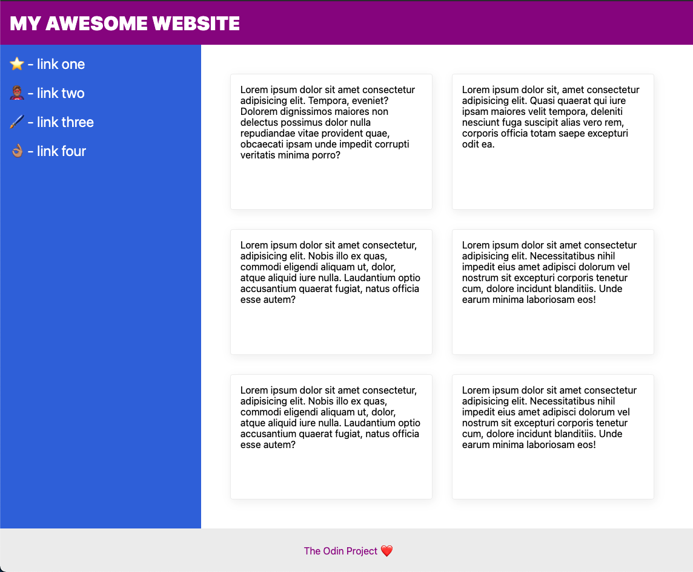

# The "Holy Grail" Layout
Den her øvelse går ud på at lave det såkaldte "holy grail" layout - Lidt cringe navn, men det kaldes det da det er et meget almindelig type layout for hjemmesider. I skal lave det med flexbox, og det bør egentlig ikke være *så* kompliceret.

## Hints
* I skal ændre `flex-direction` for at skubbe footeren ned.
* I skal tilføje nogle `divs` som containere for at få alting linet op korrekt.
* `flex-wrap` kommer til at hjælpe med at få alt linet up - Undersøg hvordan `flex-wrap` virker.
* I bør sætte en fast værdi for bredden på jeres "kort", så `flex-wrap` virker korrekt.

## Resultat

Og hvis i gør jeres browser vindue mindre, bør det gøre sådan her:

## Checkliste
* De valgte farver er forfærdelige - I må gerne ændre dem hvis i vil.
* Header-teksten er 32px med weight 900.
* Header-teksten er vertikalt centreret og 16px fra kanten af skærmen.
* Footeren er skubbet til bunden af skærmen - Muligvis endda under bunden hvis du skal scrolle.
* Footer-teksten er centreret på begge led.
* Sidebaren og kortene bruger alt den tilgængelige plads over footeren.
* Sidebaren er 300px bred, og skrumper ikke.
* Sidebar links er 24px, hvide og har IKKE underline decoration.
* Sidebar har 16px padding.
* Der er 48px padding rundt om "cards" sektionen.
* Kortene er arrangeret horizontalt, men "wrapper" til næste line hvis de løber tør for plads når du resizer vinduet.