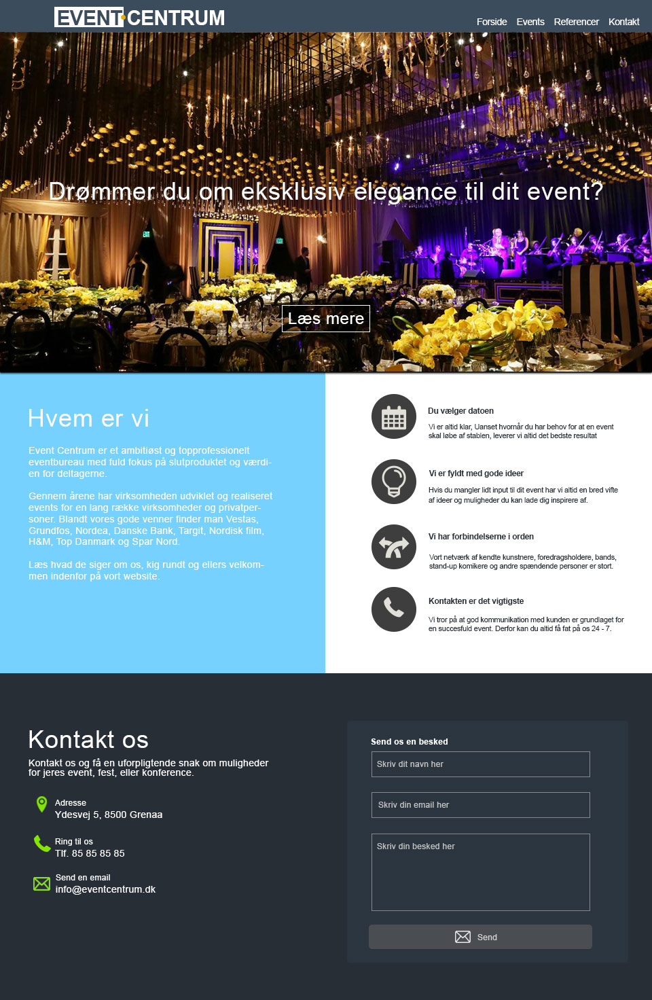

# Event Centrum Hjemmeside
Du skal opbygge forsiden til sitet i en semantisk gennemtænkt struktur (i HTML), hvor du samtidig tager højde for hensigtsmæssig navngivning og filstruktur på sitet. Siden skal som minimum være delvis responsiv - brug gerne flexbox og media queries.

## Resultat

## Design Specs
* Overskrifter: Manrope (https://fonts.google.com/share?selection.family=Manrope:wght@200..800)
* Brødtekst: Inter (https://fonts.google.com/share?selection.family=Inter:ital,opsz,wght@0,14..32,100..900;1,14..32,100..900)
* Farvekoder:
    * Lys tekst: #ffffff
    * Mørk tekst: #3e3e3e
    * Header: #3b4c5c
    * Lyseblå baggrund: #76d1ff
    * Footer: #272e36
    * Kontaktformular: #2c3640
    * Grønne detaljer: #82e602

## Hints
* Når i laver jeres HTML, så husk at i skal bruge semantisk HTML, såsom `<main>`, `<section>` og `<article>`, og ikke bare `
`.
* Husk, at det ikke forventes at i kan huske alting - Hvis i ikke kan huske hvordan man tilføjer end ny skrifttype f.eks., er det helt ok, og endda forventet, at i Googler efter det, eller spørger ChatGPT.